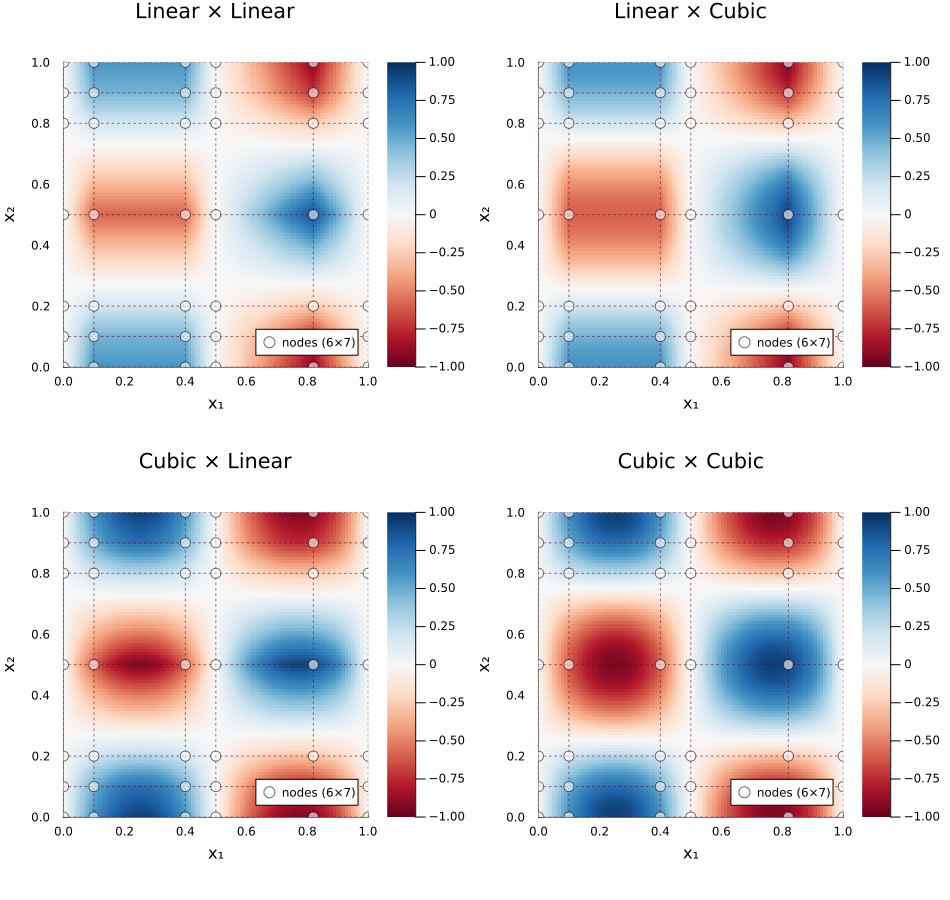

## Unified `interp` API with per-axis heterogeneous methods

Partially addresses #55 — enables per-axis method mixing. Remaining items (`NoInterp` for discrete axes, AD/adjoint) in follow-up PRs.

> *"For ND interpolation, is there a way to do, say, linear interpolation along the first dimension and quadratic interpolation along the second dimension?"* — #55

### Usage

```julia
using FastInterpolations

x = range(0, 2pi, 50)
y = range(0, 1, 30)
data = [sin(xi) * cos(yj) for xi in x, yj in y]

# Mix different methods per axis
itp = interp((x, y), data; method=(CubicInterp(), LinearInterp()))
itp((0.5, 0.3))

# Single method = same as calling cubic_interp / linear_interp directly
itp = interp((x, y), data; method=CubicInterp())   # → CubicInterpolantND

# Zero-allocation one-shot (no interpolant object created)
val = interp((x, y), data, (0.5, 0.3); method=(CubicInterp(), LinearInterp()))
```

Derivatives, gradient, hessian, laplacian all work:

```julia
itp((0.5, 0.3); deriv=(DerivOp(1), DerivOp(0)))  # ∂f/∂x
gradient(itp, (0.5, 0.3))                          # (∂f/∂x, ∂f/∂y)
hessian(itp, (0.5, 0.3))                           # 2×2 matrix
```

Per-axis BCs, extrapolation, and method options are fully supported:

```julia
# Periodic x-axis (plasma/wave data) + linear y-axis (coarse measurement)
itp = interp((x, y), data;
    method = (CubicInterp(bc=PeriodicBC()), LinearInterp()),
    extrap = (WrapExtrap(), ClampExtrap()),
)

# 3D: smooth radial, step-like angular, quadratic vertical
itp3d = interp((r, theta, z), data3d;
    method = (CubicInterp(), ConstantInterp(side=LeftSide()), QuadraticInterp()),
)
```

### Visual Comparison

Per-axis method mixing on a 6x7 non-uniform grid ($f(x,y) = \sin(2\pi x)\cos(2\pi y)$):



**Cubic x Linear** is smooth along x but piecewise-linear along y. **Linear x Cubic** shows the opposite pattern.

### Scope

This PR implements the **interpolation core** of #55:
- Constructor (`interp`), scalar/batch eval, one-shot, vector calculus
- Full `AbstractInterpolantND` protocol — batch eval, `value_gradient`, `InBounds` inherited

**Follow-up PRs** (not in scope):
- `NoInterp` — discrete/integer-index axis (skip interpolation entirely)
- AD support (ChainRules/Enzyme rrules)
- Adjoint operator (`TensorProductAdjointND`)

> `ConstantInterp(side=NearestSide())` already covers most "disable interpolation" use cases by selecting the nearest grid value without smoothing.

### Design Highlights

- **Auto-dispatch**: Homogeneous `method=CubicInterp()` transparently returns `CubicInterpolantND` — zero overhead
- **Compact storage**: Only derivative-capable axes (Cubic/Quadratic) contribute to partials — a 4D Cubic x Linear x Linear x Linear stores 2x instead of 16x
- **Pool-based one-shot**: `@with_pool` for zero allocation after warmup
- **Consistent kwargs**: `method` (singular) — same convention as `bc`, `extrap`, `search`, `deriv`

### New Exports

| Export | Description |
|--------|-------------|
| `interp(grids, data; method=...)` | Unified ND interpolant constructor |
| `interp(grids, data, query; method=...)` | Scalar one-shot (zero-alloc) |
| `interp!(output, grids, data, queries; method=...)` | In-place batch one-shot |
| `TensorProductInterpolantND` | Interpolant type (heterogeneous) |
| `CubicInterp`, `LinearInterp`, `QuadraticInterp`, `ConstantInterp` | Per-axis method types |

### Test Coverage

3 test files, ~1200 lines:
- Homogeneous auto-dispatch equivalence (all 4 methods)
- Heterogeneous accuracy (separable function verification)
- Derivatives, gradient, hessian, laplacian
- Zero-allocation (PreCompute scalar + one-shot)
- Custom BCs: PeriodicBC (inclusive + exclusive), ZeroCurvBC
- Float32, duck-typing, mixed grids (Range + Vector), SoA + AoS batch
