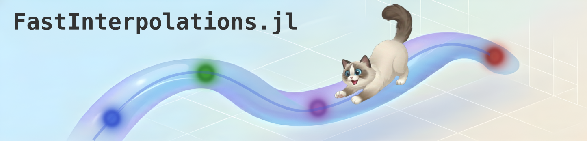
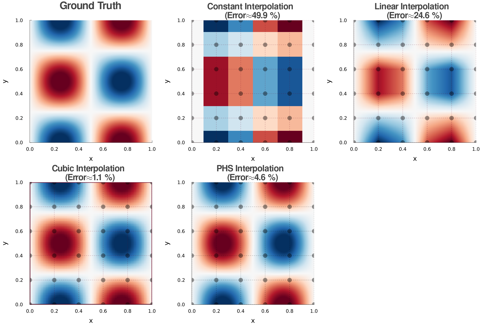

[](https://juliahub.com/ui/Packages/General/FastInterpolations)
[](https://projecttorreypines.github.io/FastInterpolations.jl/stable/)
[](https://projecttorreypines.github.io/FastInterpolations.jl/dev/)
[](https://github.com/ProjectTorreyPines/FastInterpolations.jl/actions/workflows/CI.yml)
[](https://codecov.io/github/projecttorreypines/fastinterpolations.jl)
[](https://projecttorreypines.github.io/FastInterpolations.jl/bench/)
[](https://github.com/JuliaTesting/Aqua.jl)
[](https://github.com/fredrikekre/Runic.jl)

# FastInterpolations.jl

A high-performance **N-dimensional** interpolation package for Julia, optimized for **zero-allocation hot loops**.

## Key Strengths

- 🚀 **Fast**: Optimized algorithms that outperform other packages.
- ✅ **Zero-Allocation**: No GC pressure on hot loops.
- 🎯 **Explicit BCs**: Support custom physical boundary conditions.
- 📐 **Analytic Derivatives & Integration**: Analytical differential operators (gradient, hessian, etc.) and exact spline integration.
- 🌌 **Generic**: Supports **Complex** values and **AD (AutoDiff)** — ForwardDiff, Zygote, Enzyme.
- 🧵 **Thread-Safe**: Lock-free concurrent access across multiple threads.

## Supported Methods
`FastInterpolations.jl` supports **six interpolation families** — four classical polynomial splines (**Constant**, **Linear**, **Quadratic**, **Cubic**), the **Local Cubic Hermite family** (Hermite / PCHIP / Cardinal / Akima), and **Polyharmonic Splines (PHS)**. Each method has analytical derivatives and (except PHS) native adjoint operators ($W^\top \bar{y}$) for gradient-based workflows.

### Classical splines

| Interpolation | Adjoint | Continuity | Best For |
|:-------------|:--------|:-----------|:---------|
| `constant_interp` | `constant_adjoint` | C⁻¹ | Step functions |
| `linear_interp` | `linear_adjoint` | C⁰ | Fast, lightweight, no overshoot |
| `quadratic_interp` | `quadratic_adjoint` | C¹ | Smooth derivatives at low cost |
| `cubic_interp` | `cubic_adjoint` | C² | High-accuracy C² splines |

### Local Cubic Hermite family

One cubic Hermite basis, four choices of slope rule. All C¹-continuous, O(1) per query, no global solve — each cell's slopes come from a small local stencil (or are supplied directly). ND adjoint support is on the roadmap.

| Interpolation | Adjoint (1D) | Slope rule | Best For |
|:-------------|:-------------|:-----------|:---------|
| `hermite_interp`  | `hermite_adjoint`  | user-supplied                | Physics-informed, analytical derivatives |
| `pchip_interp`    | `pchip_adjoint`    | Fritsch-Carlson (3-point)    | Monotone data (CDFs, physical bounds) |
| `cardinal_interp` | `cardinal_adjoint` | Catmull-Rom with `tension`   | Animation, spline curves through control points |
| `akima_interp`    | `akima_adjoint`    | Akima (5-point stencil)      | Noisy data, outlier-robust |

### Polyharmonic Splines (PHS)

Radial basis function method with local stencil-based interpolation, blending for C² continuity, and optional log-density smoothing transform.

| Interpolation | Adjoint | Continuity | Best For |
|:-------------|:--------|:-----------|:---------|
| `phs_interp` | — | C² | High-dimensional scattered/gridded data; smooth-on-log-scale data with custom reference functions |

**Key features:**
- **N-dimensional** (2D, 3D, ND) on any rectilinear grid
- **Analytical derivatives** (gradient, hessian, laplacian)
- **Log-density transform** f(x) = ln(ρ(x)/ρ₀(x)) for accurate derivatives near singular features (e.g., nuclear cusps)
- **Custom reference functions** — pass any callable for ρ₀(x) with derivative support to enable physics-informed interpolation (see `PromolecularRef` example)

📖 [Interpolation Overview](https://projecttorreypines.github.io/FastInterpolations.jl/dev/interpolation/overview/) 
📖 [Local Cubic Hermite](https://projecttorreypines.github.io/FastInterpolations.jl/dev/interpolation/local_hermite/) 
📖 [Polyharmonic Splines (PHS)](https://projecttorreypines.github.io/FastInterpolations.jl/dev/interpolation/phs/)
📖 [Adjoint Overview](https://projecttorreypines.github.io/FastInterpolations.jl/dev/adjoint/overview/)

## Quick Start

`FastInterpolations.jl` provides two primary API styles, plus a specialized **SeriesInterpolant** for multi-series data.

### 1. One-shot API (Dynamic Data)
Best when **`y` values change** every step, but the grid **`x` remains fixed**.

```julia
using FastInterpolations

# Define grid and query points
x = range(0.0, 10.0, 100)   # source grid (100 points)
y = sin.(x)                 # initial y data

# Basic usage
cubic_interp(x, y, 0.33) # return interpolated value at x=0.33
cubic_interp(x, y, [0.11, 0.22, 0.33]) # return values at x=[0.11,0.22,0.33]

# Advanced usage (in-place vector query)
xq = range(0.0, 10.0, 500)  # query points  (500 points)
out = similar(xq)           # pre-allocate output buffer

for t in 1:1000
    @. y = sin(x + 0.01t)           # y values evolve each timestep
    cubic_interp!(out, x, y, xq)    # zero-allocation ✅ (after warm-up)
end
```

### 2. Interpolant API (Static Data)
Best for **fixed lookup tables** where both `x` and `y` are constant.

```julia
itp = cubic_interp(x, y)       # pre-compute spline coefficients once

result = itp(5.5)              # evaluate at single point
result = itp(xq)               # evaluate at multiple points
@. result = a * itp(xq) + b    # seamless broadcast fusion
```

### 2.1 SeriesInterpolant (Multiple Series)
When multiple y-series share the same x-grid, wrap them with `Series(...)` to create a SeriesInterpolant. It leverages **SIMD** and **cache locality** for **>10× faster** evaluation compared to looping over individual interpolants.

```julia
x = range(0, 10, 100)
y_series = Series( sin.(x), cos.(x), tan.(x), exp.(-x) ) # 4 series, on the same grid

sitp = cubic_interp(x, y_series)   # create SeriesInterpolant
sitp(0.5)  # → 4-element Vector: [≈sin(0.5), ≈cos(0.5), ≈tan(0.5), ≈exp(-0.5)]
```

For detailed usage and performance trade-offs, see the [API Selection Guide](https://projecttorreypines.github.io/FastInterpolations.jl/dev/guides/api_selection/).

## Multi-Dimensional Interpolation
`FastInterpolations.jl` supports 2D, 3D, and N-dimensional interpolation on **any rectilinear grid** (uniform or non-uniform). The API generalizes the 1D case by packing axis-specific information into **Tuples** — for example, where 1D takes `x`, ND takes `(x, y, z, ...)` for the grid, query points, and parameters.
See the [ND Interpolation Guide](https://projecttorreypines.github.io/FastInterpolations.jl/dev/nd/overview/) for details.
```julia
using FastInterpolations

# Define 2D rectilinear grid (can be non-uniform) and data
x, y = [0.0, 0.2, 0.5, 1.0], range(0, 2π, 50)
data2D = [sin(xi) * cos(yi) for xi in x, yi in y]
xq, yq = [0.1, 0.2], [0.3, 0.4] # query vectors

# 1. One-shot API: (grid_tuple, data, query_tuple)
val  = cubic_interp((x, y), data2D, (0.5, 0.3)) # single point
vals = cubic_interp((x, y), data2D, (xq, yq))   # vector query

# 2. Interpolant API: Precompute coefficients once
itp = cubic_interp((x, y), data2D)
itp((0.5, 0.3)) # scalar query
itp((xq, yq)) # vector query
```

**Key Features:**
- **Flexible Grids:** Supports both uniform and non-uniform rectilinear grids.
- **Full Parity:** Every 1D feature (BCs, derivatives, extrapolation) works in ND via Tuples.
- **Zero-Allocation:** Optimized tensor-product evaluation for high-performance loops.

### Unified API: `interp` — Per-Axis Methods
Mix different interpolation methods per axis with the `interp` unified API:

```julia
# Cubic on x-axis, linear on y-axis
itp = interp((x, y), data; method=(CubicInterp(), LinearInterp()))
itp((0.5, 0.3))
gradient(itp, (0.5, 0.3))  # analytical gradient

# Zero-allocation one-shot (no interpolant created)
val = interp((x, y), data, (0.5, 0.3); method=(CubicInterp(), LinearInterp()))
```

Homogeneous methods (all same type) auto-dispatch to the optimized type — no performance penalty.

📖 [Unified API Guide](https://projecttorreypines.github.io/FastInterpolations.jl/dev/nd/unified_api/)

### 2D Visualization Example
Comparison on a non-uniform 2D rectilinear grid for $f(x, y) = \sin(2\pi x) \cos(2\pi y)$. Cubic interpolation maintains high accuracy and captures extrema even on coarse, non-uniform grids. The gray dots in the image below represent the given node points (6x7 grid), and the dashed lines illustrate the grid structure.


Another comparison with the same function, but on a uniform 2D 6x6 grid. The uniform grid allows the cubic spline to achieve even higher accuracy, closely matching the true function values across the domain.




## Performance

Benchmark comparison against [Interpolations.jl](https://github.com/JuliaMath/Interpolations.jl), [DataInterpolations.jl](https://github.com/SciML/DataInterpolations.jl), and [Dierckx.jl](https://github.com/JuliaMath/Dierckx.jl) for **cubic spline interpolation**.
<!-- BENCHMARK_VERSIONS_START -->
> **Env:** Local · macOS 15.7.3 · Apple M1 Pro · Julia 1.12.6<br>
> **Pkg:** FastInterpolations (v0.4.9) · Interpolations (v0.16.2) · DataInterpolations (v8.9.0) · Dierckx (v0.5.4)
<!-- BENCHMARK_VERSIONS_END -->


<!-- BENCHMARK_SPEEDUP_START -->
**Speedup:** (2.4 ~ 15.0)× vs `Interpolations.jl` · (8.5 ~ 24.2)× vs `DataInterpolations.jl` · (14.4 ~ 19.7)× vs `Dierckx.jl`
<!-- BENCHMARK_SPEEDUP_END -->

One-shot (construction + evaluation) time per call with fixed grid size $n=100$. `FastInterpolations.jl` is significantly faster even on the first call (cache-miss), and becomes even faster on subsequent calls (cache-hit).

## More Features

### Analytic Derivatives
Exact 1st–3rd order derivatives from spline coefficients — no finite differences. ND interpolants support `gradient`, `hessian`, and `laplacian`.
```julia
# 1D example
cubic_interp(x, y, 5.0; deriv=DerivOp(1))   # 1D: f'(x)

# 2D example 
itp2d = cubic_interp((x, y), data2D)

point = (0.5, 1.0)                       # query point (x, y)
itp2d(point; deriv=DerivOp(1, 0))        # ∂f/∂x
itp2d(point; deriv=DerivOp(1, 1))        # ∂²f/∂x∂y (mixed partial)
gradient(itp2d, point)                   # (∂f/∂x, ∂f/∂y)
hessian(itp2d, point)                    # 2×2 Hessian matrix
```
📖 [1D Derivatives](https://projecttorreypines.github.io/FastInterpolations.jl/dev/interpolation/derivatives/) · [ND Derivatives](https://projecttorreypines.github.io/FastInterpolations.jl/dev/nd/derivatives/)

### Analytic Integration
Exact definite integration from spline coefficients — no numerical quadrature.
```julia
itp = cubic_interp(x, y)
integrate(itp, 0.0, π)                       # 1D: ∫₀^π f(x) dx

itp2d = cubic_interp((x, y), data2D)
integrate(itp2d, (0.0, 0.0), (1.0, 1.0))    # 2D: ∫∫ f dA over [0,1]²
integrate(itp2d)                              # 2D: full-domain integral
```
📖 [1D Integration](https://projecttorreypines.github.io/FastInterpolations.jl/dev/interpolation/integration/) · [ND Integration](https://projecttorreypines.github.io/FastInterpolations.jl/dev/nd/integration/)

### Boundary Conditions
Rich type system for physical BCs — Neumann, periodic, polynomial fit, and custom per-endpoint.
```julia
cubic_interp(x, y, xq; bc=CubicFit())                        # cubic polynomial fit (default)
cubic_interp(x, y, xq; bc=PeriodicBC())                      # C²-continuous periodic
cubic_interp(x, y, xq; bc=BCPair(Deriv1(2.0), Deriv1(0.0)))  # Neumann: specify f' at each end
cubic_interp(x, y, xq; bc=BCPair(Deriv1(2.0), Deriv2(0.0)))  # mixed: slope left, curvature right
```
📖 [Boundary Conditions Guide](https://projecttorreypines.github.io/FastInterpolations.jl/dev/boundary-conditions/overview/)

### Extrapolation
Queries outside the data domain throw `DomainError` by default. Use `Extrap()` to allow them:
```julia
cubic_interp(x, y; extrap=Extrap(:clamp))             # clamp to boundary value
cubic_interp(x, y; extrap=Extrap(:extend))            # extend boundary polynomial
cubic_interp(x, y; extrap=Extrap(:fill; fill_value=NaN)) # fill with constant value
# also :wrap (periodic) and :none (default, throws DomainError)
```
📖 [Extrapolation Guide](https://projecttorreypines.github.io/FastInterpolations.jl/dev/extrapolation/) · 

### Search
Non-uniform (`Vector`) grids require an interval search. The default `AutoSearch()` picks the best strategy per-call:
```julia
itp = linear_interp(x_vec, y_vec; search=AutoSearch())  # default, adapts per-call
itp(0.5)          # scalar → binary search
itp(sorted_xq)    # sorted detected → linear walk + binary fallback
itp(rand_xq)      # random detected → binary search
itp(0.5; search=BinarySearch())  # manual override (rarely needed)
```
📖 [Search Policies](https://projecttorreypines.github.io/FastInterpolations.jl/dev/guides/search/policies/)

### Hints
Give the search a positional hint to speed up lookup — enables O(1) sequential access (ODE solvers, streaming):
```julia
itp = cubic_interp(x, y)
hint = Ref(1)  # grid interval index, updated automatically
for t in time_steps  # monotonic or streaming
    val = itp(t; hint=hint)  # hint is reused & updated each call
end
```
📖 [Using Hints](https://projecttorreypines.github.io/FastInterpolations.jl/dev/guides/search/hints/)

**See also:** [Factory Functions](https://projecttorreypines.github.io/FastInterpolations.jl/dev/guides/factory_functions/) · [Complex Numbers](https://projecttorreypines.github.io/FastInterpolations.jl/dev/guides/complex_number_support/) · [AutoDiff](https://projecttorreypines.github.io/FastInterpolations.jl/dev/guides/autodiff_support/) · [Thread Safety](https://projecttorreypines.github.io/FastInterpolations.jl/dev/architecture/thread_safety/) · [Optim.jl Integration](https://projecttorreypines.github.io/FastInterpolations.jl/dev/guides/optimization/)

## Polyharmonic Spline Implementation Notes

While PHS shares the core philosophy of FastInterpolations.jl (zero-allocation, analytical derivatives), it differs in several implementation details:

- Derivative API: PHS uses the direct deriv keyword approach (`itp(q; deriv=...)`) rather than the gradient()/hessian() functions used by other methods
- Boundary Conditions: PHS achieves C² continuity through blending rather than traditional boundary condition types
- Search & Hints: The stencil-based approach eliminates the need for interval search and positional hints
- Integration: Analytical integration is not currently implemented for PHS (focus is on density/derivative evaluation)

These differences reflect the mathematical nature of polyharmonic splines rather than limitations. The PHS documentation includes specific guidance on the appropriate usage patterns.

## Documentation

For detailed guides on boundary conditions, extrapolation, and performance tuning, visit the [Documentation](https://projecttorreypines.github.io/FastInterpolations.jl).


## License
Apache License 2.0

## Contact
Min-Gu Yoo [](https://www.linkedin.com/in/min-gu-yoo-704773230) (General Atomics)  yoom@fusion.gat.com