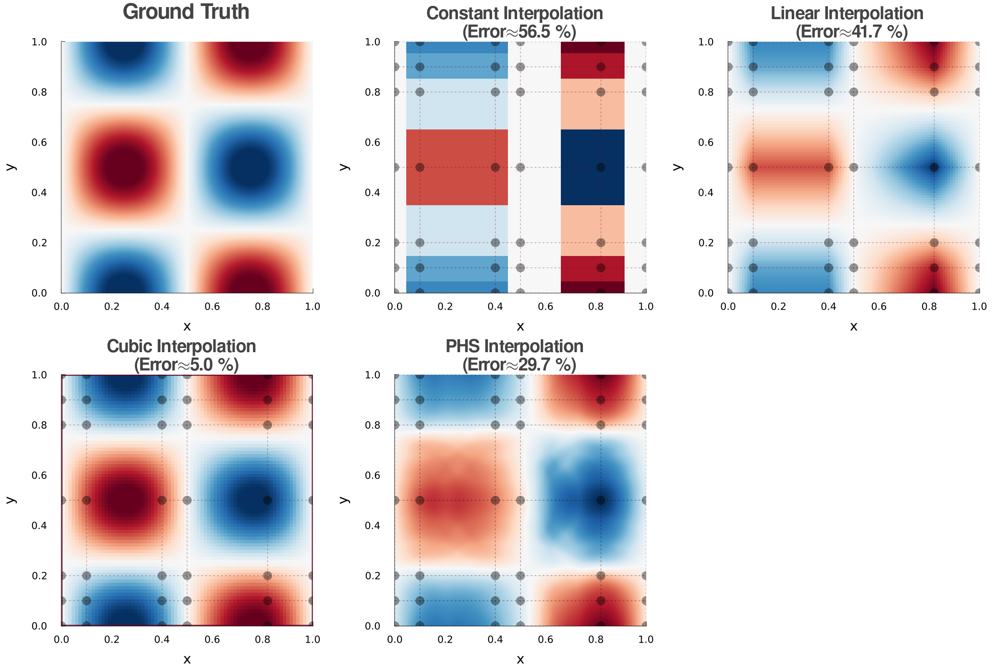
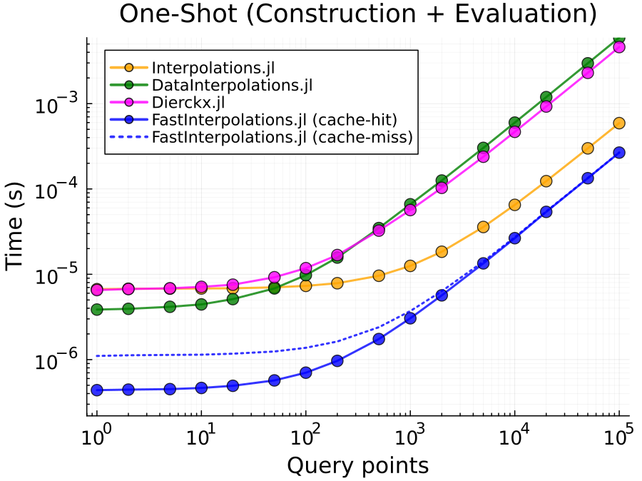

[](https://projecttorreypines.github.io/FastInterpolations.jl/stable/)
[](https://projecttorreypines.github.io/FastInterpolations.jl/dev/)
[](https://github.com/ProjectTorreyPines/FastInterpolations.jl/actions/workflows/CI.yml)
[](https://codecov.io/github/projecttorreypines/fastinterpolations.jl)
[](https://projecttorreypines.github.io/FastInterpolations.jl/bench/)

# FastInterpolations.jl

A high-performance **N-dimensional** interpolation package for Julia, optimized for **zero-allocation hot loops**.

## Key Strengths

- 🚀 **Fast**: Optimized algorithms that outperform other packages.
- ✅ **Zero-Allocation**: No GC pressure on hot loops.
- 🎯 **Explicit BCs**: Support custom physical boundary conditions.
- 📐 **Analytic Derivatives & Integration**: Analytical differential operators (gradient, hessian, etc.) and exact spline integration.
- 🌌 **Generic**: Supports **Complex** values and **AD (AutoDiff)** — ForwardDiff, Zygote, Enzyme.
- 🧵 **Thread-Safe**: Lock-free concurrent access across multiple threads.

## Supported Methods
`FastInterpolations.jl` supports four interpolation methods: `Constant`, `Linear`, `Quadratic`, and `Cubic` splines.

| Method | Continuity | Best For |
|:-------|:-----------|:---------|
| `constant_interp` | C⁻¹ | Step functions |
| `linear_interp` | C⁰ | Fast, lightweight, no overshoot |
| `quadratic_interp` | C¹ | Smooth derivatives at low cost |
| `cubic_interp` | C² | High-accuracy splines |

## Quick Start

`FastInterpolations.jl` provides two primary API styles, plus a specialized **SeriesInterpolant** for multi-series data.

### 1. One-shot API (Dynamic Data)
Best when **`y` values change** every step, but the grid **`x` remains fixed**.

```julia
using FastInterpolations

# Define grid and query points
x = range(0.0, 10.0, 100)   # source grid (100 points)
y = sin.(x)                 # initial y data

# Basic usage
cubic_interp(x, y, 0.33) # return interpolated value at x=0.33
cubic_interp(x, y, [0.11, 0.22, 0.33]) # return values at x=[0.11,0.22,0.33]

# Advanced usage (in-place vector query)
xq = range(0.0, 10.0, 500)  # query points  (500 points)
out = similar(xq)           # pre-allocate output buffer

for t in 1:1000
    @. y = sin(x + 0.01t)           # y values evolve each timestep
    cubic_interp!(out, x, y, xq)    # zero-allocation ✅ (after warm-up)
end
```

### 2. Interpolant API (Static Data)
Best for **fixed lookup tables** where both `x` and `y` are constant.

```julia
x = range(0.0, 10.0, 100)
y = sin.(x)

itp = cubic_interp(x, y)       # pre-compute spline coefficients once

result = itp(5.5)              # evaluate at single point
result = itp(xq)               # evaluate at multiple points
@. result = a * itp(xq) + b    # seamless broadcast fusion
```

### 2.1 SeriesInterpolant (Multiple Series)
When multiple y-series share the same x-grid, use SeriesInterpolant. It leverages **SIMD** and **cache locality** for **10-100× faster** evaluation compared to looping over individual interpolants.

```julia
x = range(0, 10, 100)
y1, y2, y3, y4 = sin.(x), cos.(x), tan.(x), exp.(-x)  # 4 series, same grid

sitp = cubic_interp(x, [y1, y2, y3, y4])   # create SeriesInterpolant
sitp(0.5)  # → 4-element Vector: interpolated values for each series
```

For detailed usage and performance trade-offs, see the [API Selection Guide](https://projecttorreypines.github.io/FastInterpolations.jl/dev/guides/api_selection/).

## Multi-Dimensional Interpolation
`FastInterpolations.jl` supports 2D, 3D, and N-dimensional interpolation on **any rectilinear grid** (uniform or non-uniform). The API generalizes the 1D case by packing axis-specific information into **Tuples** — for example, where 1D takes `x`, ND takes `(x, y, z, ...)` for the grid, query points, and parameters.
See the [ND Interpolation Guide](https://projecttorreypines.github.io/FastInterpolations.jl/dev/nd/overview/) for details.
```julia
using FastInterpolations

# Define 2D rectilinear grid (can be non-uniform) and data
x, y = [0.0, 0.2, 0.5, 1.0], range(0, 2π, 50)
data2D = [sin(xi) * cos(yi) for xi in x, yi in y]
xq, yq = [0.1, 0.2], [0.3, 0.4] # query vectors

# 1. One-shot API: (grid_tuple, data, query_tuple)
val  = cubic_interp((x, y), data2D, (0.5, 0.3)) # single point
vals = cubic_interp((x, y), data2D, (xq, yq))   # vector query

# 2. Interpolant API: Precompute coefficients once
itp = cubic_interp((x, y), data2D)
itp((0.5, 0.3)) # scalar query
itp((xq, yq)) # vector query
```

**Key Features:**
- **Flexible Grids:** Supports both uniform and non-uniform rectilinear grids.
- **Full Parity:** Every 1D feature (BCs, derivatives, extrapolation) works in ND via Tuples.
- **Zero-Allocation:** Optimized tensor-product evaluation for high-performance loops.

### 2D Visualization Example
Comparison on a non-uniform 2D rectilinear grid for $f(x, y) = \sin(2\pi x) \cos(2\pi y)$. Cubic interpolation maintains high accuracy and captures extrema even on coarse, non-uniform grids. The gray dots in the image below represent the given node points (6x7 grid), and the dashed lines illustrate the grid structure.



## Performance

Benchmark comparison against [Interpolations.jl](https://github.com/JuliaMath/Interpolations.jl), [DataInterpolations.jl](https://github.com/SciML/DataInterpolations.jl), and [Dierckx.jl](https://github.com/JuliaMath/Dierckx.jl) for **cubic spline interpolation**.
<!-- BENCHMARK_VERSIONS_START -->
> **Env:** Local · macOS 15.7.3 · Apple M1 Pro · Julia 1.12.5<br>
> **Pkg:** FastInterpolations (v0.2.11) · Interpolations (v0.16.2) · DataInterpolations (v8.9.0) · Dierckx (v0.5.4)
<!-- BENCHMARK_VERSIONS_END -->



<!-- BENCHMARK_SPEEDUP_START -->
**Speedup:** (2.2 ~ 15.3)× vs `Interpolations.jl` · (8.8 ~ 22.6)× vs `DataInterpolations.jl` · (14.9 ~ 18.7)× vs `Dierckx.jl`
<!-- BENCHMARK_SPEEDUP_END -->

One-shot (construction + evaluation) time per call with fixed grid size $n=100$. `FastInterpolations.jl` is significantly faster even on the first call (cache-miss), and becomes even faster on subsequent calls (cache-hit).

## More Features

```julia
# Analytical derivatives — all methods support 1st, 2nd, 3rd derivatives
cubic_interp(x, y, 5.0; deriv=1)   # 1st derivative at x=5.0
cubic_interp(x, y, 5.0; deriv=2)   # 2nd derivative at x=5.0
cubic_interp(x, y, 5.0; deriv=3)   # 3rd derivative at x=5.0

# Constant interpolation — choose which side to sample
constant_interp(x, y, xq; side=:nearest) # nearest neighbor (default)
constant_interp(x, y, xq; side=:left)    # left-continuous 
constant_interp(x, y, xq; side=:right)   # right-continuous

# Quadratic boundary condition — single endpoint constraint
quadratic_interp(x, y, xq; bc=Left(Deriv1(0.0)))   # S'(left) = 0
quadratic_interp(x, y, xq; bc=Right(Deriv1(1.0)))  # S'(right) = 1

# Cubic boundary conditions — paired endpoint constraints
cubic_interp(x, y, xq; bc=NaturalBC())    # S''=0 at both ends (default)
cubic_interp(x, y, xq; bc=PeriodicBC())   # C²-continuous periodic spline
cubic_interp(x, y, xq; bc=BCPair(Deriv1(2.0), Deriv2(-5.0)))  # custom (left, right) BC
cubic_interp(x, y, xq; bc=CubicFit())     # Estimate derivatives using 4-point fit at both ends 

# Extrapolation modes — all methods support these
linear_interp(x, y, xq; extrap=:constant)    # clamp to boundary values
quadratic_interp(x, y, xq; extrap=:wrap)     # wrap around (periodic data)
cubic_interp(x, y, xq; extrap=:extension)    # extend boundary polynomial
```

## Documentation

For detailed guides on boundary conditions, extrapolation, and performance tuning, visit the [Documentation](https://projecttorreypines.github.io/FastInterpolations.jl).


## License
Apache License 2.0

## Contact
Min-Gu Yoo [](https://www.linkedin.com/in/min-gu-yoo-704773230) (General Atomics)  yoom@fusion.gat.com