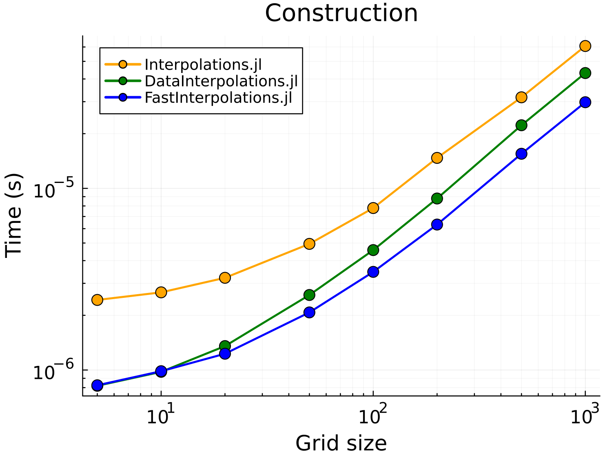
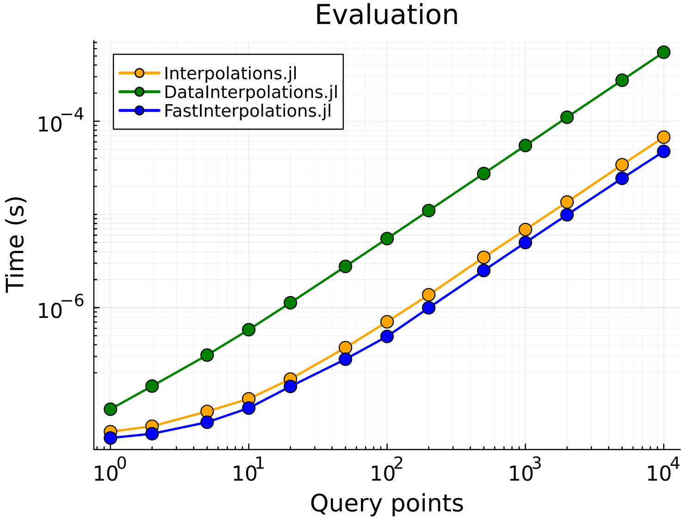

# Benchmarks

Performance comparison against [Interpolations.jl](https://github.com/JuliaMath/Interpolations.jl) and [DataInterpolations.jl](https://github.com/SciML/DataInterpolations.jl).

## Setup

```bash
cd benchmark
julia --project=. -e 'using Pkg; Pkg.instantiate()'
```

## Configuration

The benchmark duration is set to `DEFAULT_BENCH_SECONDS = 0.5` in `simple_benchmarks.jl` for faster iteration. For more accurate results, increase this value to 5 or higher:

```julia
# In simple_benchmarks.jl, line 39
const DEFAULT_BENCH_SECONDS = 5.0  # More accurate results
```

Note: The result plots below were generated with `DEFAULT_BENCH_SECONDS = 5.0` or higher.

## Usage

```julia
using Pkg; Pkg.activate("benchmark")
include("simple_benchmarks.jl")
include("plot_scaling.jl")

# Run full scaling benchmark
result = benchmark_scaling()

# Generate plots
plot_scaling_separate(result; save_dir="../docs/images", dpi=250)
```

## Output

- `result.construction` - Construction time vs grid size (5 to 1000 points)
- `result.evaluation` - Evaluation time vs query points (1 to 10000, fixed grid n=100)
- `result.oneshot` - One-shot (construction + evaluation) time with cache-hit/miss comparison

## Results

### Construction



Time to build the interpolant from scratch (varying grid size, 5 to 1000 points).

### Evaluation



Time to evaluate query points using a pre-built interpolant (fixed grid size n=100, varying query points 1 to 10000).

### One-Shot (Construction + Evaluation)


Combined construction + evaluation time per call (fixed grid size n=100, varying query points).

## Generated Plots

| Plot | Description |
|------|-------------|
| `benchmark_construction.png` | Construction time scaling |
| `benchmark_evaluation.png` | Evaluation time scaling |
| `benchmark_oneshot.png` | One-shot time scaling |
| `benchmark_oneshot_detail.png` | One-shot with cache-hit vs cache-miss |
| `benchmark_oneshot_allocation.png` | One-shot memory allocation |
| `benchmark_construction_allocation.png` | Construction memory allocation |
