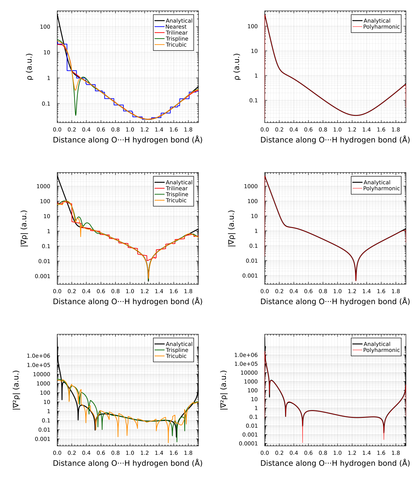

# Polyharmonic Splines (PHS)

## Overview

Polyharmonic splines (PHS) are **radial basis function (RBF) interpolants** optimized for smooth approximation of multidimensional gridded data. They are particularly effective for **smooth-on-log-scale data** and when combined with **custom reference functions**, enabling physics-informed interpolation in specialized domains like quantum chemistry.

**Key advantages:**
- **C² continuous** with analytical derivatives everywhere
- **Stencil-based evaluation** — cost independent of grid size
- **Log-density transform** — accurate near singularities (e.g., nuclear cusps)
- **Custom reference functions** — encode domain knowledge without modifying the core algorithm

## Mathematical Foundation

This section summarizes the polyharmonic spline method. For full details, see the [paper](https://doi.org/10.1063/5.0090232).

### Basic PHS Interpolant

A polyharmonic spline is constructed as:

$$\omega(x) = \sum_i w_i \phi(\|x - x_i\|) + p(x)$$

where:
- $\{x_i\}$ are $N$ stencil nodes (grid points)
- $\phi(r) = r^K$ is the radial kernel ($K$ odd, typically $K=3$ for $\phi(r)=r^3$)
- $p(x) = v_0 + v_x x + v_y y + v_z z$ is a linear polynomial augmentation
- $w_i$ and $v$ are interpolation coefficients determined by solving:

$$\begin{pmatrix} \Phi & C^T \\ C & 0 \end{pmatrix} \begin{pmatrix} w \\ v \end{pmatrix} = \begin{pmatrix} \rho \\ 0 \end{pmatrix}$$

where $\Phi_{ij} = \phi(\|x_i - x_j\|)$, $C_i = (1, x_i)$, and $\rho = (\rho_1, \ldots, \rho_N)$ are data values.

### Log-Density Smoothing Transform

For data with singularities or rapid variation (e.g., electron density near nuclei), interpolate the transformed function:

$$f(x) = \ln\left(\frac{\rho(x)}{\rho_0(x)}\right)$$

where $\rho_0(x)$ is a smooth **reference function** (e.g., promolecular density, empirical model, or physical constraint).

The interpolant is built on $f(x)$, which is smooth by design. Evaluation recovers the original density and derivatives via the chain rule:

$$\tilde{\rho} = \rho_0 \exp(f)$$

$$\tilde{\rho}_\xi = \rho_0 \left( f_\xi + \frac{\rho_{0\xi}}{\rho_0} \right)$$

$$\tilde{\rho}_{\xi\zeta} = \rho_0 \left( f_{\xi\zeta} + \frac{\rho_\xi \rho_\zeta}{\rho_0^2} + \frac{\rho_{0\xi\zeta}}{\rho_0} - \frac{\rho_{0\xi}\rho_{0\zeta}}{\rho_0^2} \right)$$

### Blending for C² Continuity

Since stencils change discontinuously at grid node boundaries, a **blend function** combines multiple local interpolants:

$$\rho(x) = \frac{\sum_i w_i(x) \tilde{\rho}_i(x)}{\sum_i w_i(x)}$$

with smooth weight $w_i(x)$ that transitions from 1 at node $x_i$ to 0 at distance $a$ (blend range). This ensures $C^2$ continuity across the domain.

## API Usage

### Basic PHS Interpolation

```julia
using FastInterpolations

# Define grid and data
x = range(0.0, 1.0, 20)
y = range(0.0, 1.0, 20)
data = [sin(xi) * cos(yj) for xi in x, yj in y]

# Create interpolant
itp = phs_interp((x, y), data; stencil_size = 8, degree = 3, blend_factor = 1.75)

# Query
val = itp((0.5, 0.3))
grad = itp((0.5, 0.3); deriv = (DerivOp(1), DerivOp(0)))
```

### With Custom Reference Function

```julia
# Define reference density
ref = ConstantRef(1.0)  # simple constant reference

# Build PHS with log-transform
itp = phs_interp((x, y), data; 
    reference_interp = ref, 
    stencil_size = 8, 
    degree = 3)

# Stored data is log(ρ/ρ₀); evaluation returns ρ
val = itp((0.5, 0.3))  # ≈ ρ(0.5, 0.3), not log(ρ)
```

### Custom Reference with Analytical Derivatives

Create a callable reference function supporting the interface `ref(q)` and `ref(q; deriv=(DerivOp(...), ...))`:

```julia
struct MyReference
    # ... state ...
end

(ref::MyReference)(q; deriv=nothing) = begin
    if deriv === nothing
        # return value
        return ρ₀(q)
    else
        # return derivatives based on deriv tuple
        # deriv = (DerivOp(n₁), DerivOp(n₂), DerivOp(n₃))
        # means ∂^(n₁+n₂+n₃)ρ₀/∂x^n₁ ∂y^n₂ ∂z^n₃
        ...
    end
end

itp = phs_interp((x, y, z), rho_data;
    reference_interp = MyReference(),
    stencil_size = 8,
    degree = 3)
```

## Parameters and Tuning

| Parameter | Default | Notes |
|-----------|---------|-------|
| `stencil_size` | 8 | Stencil nodes per axis (total = stencil_size^N). Increase for smoother but slower interpolant. |
| `degree` | 3 | PHS degree: 1, 3, 5, … (odd only). Higher → smoother, larger condition number. |
| `blend_factor` | 2.0 | Blend range = blend_factor × max_grid_spacing. Increase for wider blending. |
| `reference_interp` | nothing | Optional custom reference function for log-transform. Use `ConstantRef(val)` for constant reference. |
| `reference_data` | nothing | Pre-computed reference values on grid (avoids re-evaluating `reference_interp` at every grid node). |

## Example: Quantum Chemistry

The script [`scripts/phs_density_comparison.jl`](https://github.com/ProjectTorreyPines/FastInterpolations.jl/blob/feat/phs-interpolation/scripts/phs_density_comparison.jl) demonstrates PHS for **electron density interpolation** in a phenol dimer, recreating Figure 2 in [the paper](https://doi.org/10.1063/5.0090232). It uses:

- **Data**: DFT-computed electron density on a 75×113×70 grid
- **Reference**: Analytical promolecular density (sum of PBE atomic densities from [critic2](https://github.com/aoterodelaroza/critic2))
- **Validation**: Comparison of density, gradient, and Laplacian along a hydrogen-bond path

The resulting plot shows exceptional agreement with analytical values, even near nuclear cusps and steep features:



***Left column:** Standard 3D interpolation methods (nearest, linear, cubic spline, cardinal) vs. analytical DFT values. All exhibit spurious oscillations and errors near the nuclei. **Right column:** PHS with log-density transform and promolecular reference. Smooth, accurate across the domain, with only minor deviations very close to nuclei.*

### Running the Example

The script automatically downloads wavefunction files on first run:

```bash
cd scripts/
julia --project=. phs_density_comparison.jl
```

This generates `phs_density_comparison.png` and demonstrates:
- Loading XYZ atomic geometry
- Building PromolecularRef from critic2 PBE wavefunctions
- Constructing PHS interpolant with log-transform
- Evaluating density, gradient, Laplacian analytically
- Batch evaluation for performance

### Performance

For the phenol dimer example (75×113×70 grid, 1000 query points):

#### Timing Summary (per method, 1000 query points)

| Method | Build (s) | ρ Time (s) | \|∇ρ\| Time (s) | \|∇²ρ\| Time (s) |
|--------|-----------|------------|--------------|----------------|
| Nearest            | 0.176278 |   0.483935 |            — |              — |
| Linear             | 0.008676 |   0.259310 |     0.592057 |              — |
| Cubic              | 0.569003 |   0.334952 |     0.825838 |       0.867262 |
| Cardinal           | 0.040574 |   1.043034 |     2.426582 |       2.469174 |
| PHS                | 2.516633 |   1.557916 |    12.222952 |      28.424406 |

#### Charge Density (ρ) — Relative Error Statistics

| Method | Min Error | Max Error | Mean Error | Median Error |
|--------|-----------|-----------|------------|--------------|
| Nearest            | 5.27e-04 | 2.15e+00 | 1.84e-01 | 1.34e-01 |
| Linear             | 1.68e-05 | 9.34e-01 | 8.80e-02 | 2.18e-02 |
| Cubic              | 4.58e-06 | 9.73e-01 | 1.17e-01 | 3.36e-03 |
| Cardinal           | 2.29e-05 | 9.21e-01 | 9.65e-02 | 3.47e-03 |
| PHS                | 1.48e-08 | 1.00e+00 | 4.06e-03 | 1.61e-04 |

#### Gradient Magnitude (|∇ρ|) — Relative Error Statistics

| Method | Min Error | Max Error | Mean Error | Median Error |
|--------|-----------|-----------|------------|--------------|
| Linear             | 3.75e-05 | 2.39e+01 | 4.14e-01 | 1.89e-01 |
| Cubic              | 2.39e-05 | 3.36e+00 | 3.57e-01 | 2.65e-02 |
| Cardinal           | 1.83e-04 | 2.52e+00 | 2.48e-01 | 3.23e-02 |
| PHS                | 7.68e-07 | 1.00e+00 | 1.17e-02 | 1.11e-03 |

#### Laplacian Magnitude (|∇²ρ|) — Relative Error Statistics

| Method | Min Error | Max Error | Mean Error | Median Error |
|--------|-----------|-----------|------------|--------------|
| Cubic              | 8.30e-06 | 1.13e+03 | 6.41e+00 | 1.69e-01 |
| Cardinal           | 7.58e-04 | 1.96e+02 | 2.41e+00 | 5.03e-01 |
| PHS                | 1.28e-05 | 3.09e+00 | 4.73e-02 | 1.37e-02 |

## References

- **Paper**: Otero-de-la-Roza, A. *Finding critical points and reconstruction of electron densities on grids*. J. Chem. Phys. 156, 224116 (2022) https://doi.org/10.1063/5.0090232.
- **critic2**: Database of PBE all-electron atomic densities
  https://github.com/aoterodelaroza/critic2/tree/master/dat/wfc
